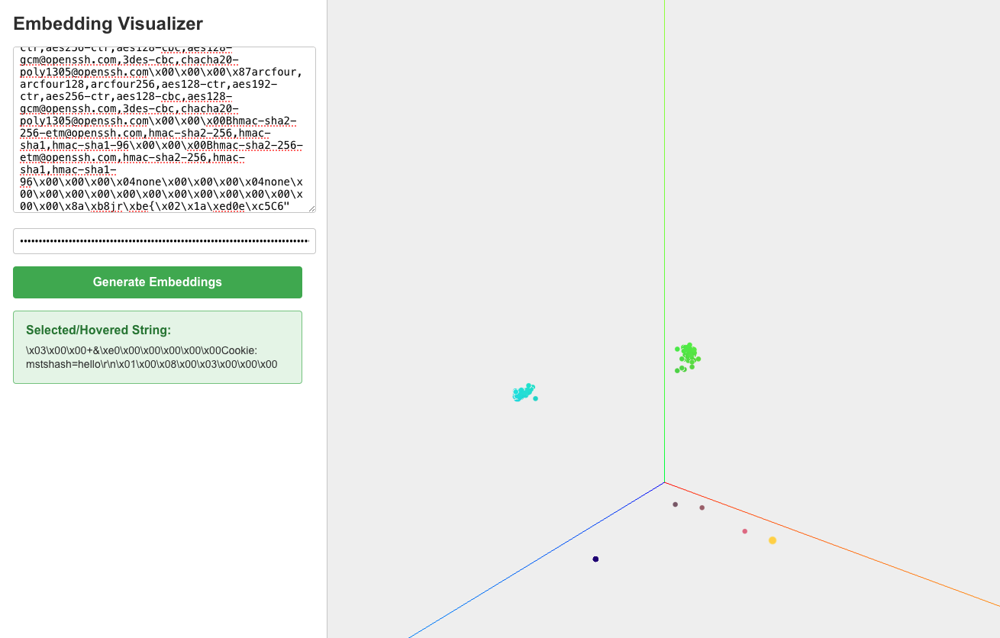

# 🌌 Embedding Visualizer



## 🚀 Introduction

Embedding Visualizer is an interactive tool that brings your text embeddings to life in a stunning 3D space! 🎨✨ This project allows you to visualize the relationships between different text strings based on their embeddings, making it easier to understand and explore the semantic connections in your data.

## 🌟 Features

- 📊 Generate embeddings from text input using OpenAI's API
- 🔮 Visualize embeddings in an interactive 3D space
- 🖱️ Click and hover interactions for exploring individual data points
- 🎭 Dynamic highlighting and animation of selected points
- 📏 Axis visualization for better orientation in 3D space
- 🔍 Zoom, pan, and rotate functionality for detailed exploration

## 🛠️ Technologies Used

- ⚛️ React
- 🌐 Three.js for 3D rendering
- 📊 PCA (Principal Component Analysis) for dimensionality reduction
- 🧠 OpenAI API for generating embeddings

## 🚀 Getting Started

1. Clone the repository:
   ```
   git clone https://github.com/yourusername/embedding-visualizer.git
   ```

2. Install dependencies:
   ```
   cd embedding-visualizer
   npm install
   ```

3. Set up your OpenAI API key:
   - Create a `.env` file in the root directory
   - Add your API key: `REACT_APP_OPENAI_API_KEY=your_api_key_here`

4. Start the development server:
   ```
   npm start
   ```

5. Open your browser and navigate to `http://localhost:3000`

## 🎮 How to Use

1. 📝 Enter your text strings in the input area (one per line)
2. 🔑 Input your OpenAI API key
3. 🚀 Click "Generate Embeddings" to create and visualize the embeddings
4. 🖱️ Explore the 3D space:
   - Click and drag to rotate the view
   - Scroll to zoom in/out
   - Hover over points to see the corresponding text
   - Click on points to highlight them

## 🤝 Contributing

Contributions, issues, and feature requests are welcome! Feel free to check the [issues page](https://github.com/yourusername/embedding-visualizer/issues).

## 📜 License

This project is [MIT](https://choosealicense.com/licenses/mit/) licensed.

## 🙏 Acknowledgements

- OpenAI for providing the embedding API
- Three.js community for the amazing 3D graphics library
- All contributors and users of this project

---

Happy Visualizing! 🎉🔍🚀